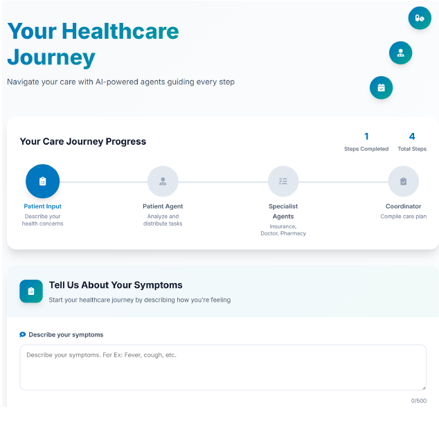

# 🏥 NaviCare - Insurance Agent Management Platform



## 🌟 Overview

NaviCare is a comprehensive Django-based platform designed specifically for insurance agents to manage their clients, track policy applications, calculate commissions, and streamline their insurance business operations. Built with modern web technologies and focused on the insurance industry workflow.

## ✨ Features

### 🎯 Insurance Agent Management
- **Agent Profiles**: Comprehensive agent information with certification levels
- **Client Management**: Track prospects, active clients, and client interactions
- **Policy Applications**: Complete application workflow management
- **Commission Tracking**: Automated commission calculation and payment tracking
- **Activity Logging**: Detailed logs of client interactions and follow-ups

### 📊 Dashboard & Analytics
- **Agent Dashboard**: Real-time statistics and performance metrics
- **Client Overview**: Quick access to client status and contact history
- **Application Pipeline**: Track applications from submission to approval
- **Commission Reports**: Detailed commission summaries by period
- **Activity Feed**: Recent activities and scheduled follow-ups

### 🔧 Insurance Business Tools
- **Quote Calculator**: Generate accurate insurance quotes for clients
- **Plan Comparison**: Compare different insurance plans and carriers
- **Coverage Analysis**: Detailed plan benefits and cost structures
- **Carrier Management**: Work with multiple insurance carriers
- **Client Communication**: Track all client touchpoints and outcomes

## 🚀 Getting Started

## 🚀 Getting Started

### Prerequisites
- Python 3.8+ 
- Docker (for PostgreSQL database)
- Modern web browser

### 🔧 Complete Setup Instructions

#### Step 1: Clone and Setup Project
```bash
# Clone the repository
git clone https://github.com/justgoofingaround/NaviCare.git
cd NaviCare
```

#### Step 2: Setup PostgreSQL Database
```bash
cd backend
python setup_postgres.py
```
This will:
- Start PostgreSQL in Docker container
- Create the `navicare_django_db` database
- Set up user credentials

#### Step 3: Install Python Dependencies
```bash
pip install -r requirements.txt
```

#### Step 4: Setup Django Database
```bash
# Create database tables
python manage.py makemigrations
python manage.py migrate

# Load sample insurance data (agents, clients, plans)
python manage.py populate_sample_data
```

#### Step 5: Create Admin User (Optional)
```bash
python manage.py createsuperuser
```

#### Step 6: Start Django Backend
```bash
python manage.py runserver 8001
```
🔗 Backend API will be available at: **http://localhost:8001**

#### Step 7: Start Frontend Server
```bash
# In a new terminal, from the root directory
cd NaviCare
python -m http.server 5500
```
🔗 Frontend will be available at: **http://localhost:5500**

### 🌐 Access the Application

#### **Main Dashboard**
- **URL**: http://localhost:5500/web/views/dashboard.html
- **Features**: Symptom intake, insurance coverage lookup, provider search

#### **Insurance Page**
- **URL**: http://localhost:5500/web/views/insurance.html  
- **Features**: Detailed insurance plan information and coverage details

#### **Django Admin Interface**
- **URL**: http://localhost:8001/admin/
- **Features**: Manage agents, clients, plans, and carriers

#### **API Documentation**
- **Health Check**: http://localhost:8001/api/health/
- **Insurance Plans**: http://localhost:8001/api/plans/
- **Agents**: http://localhost:8001/api/agents/

### 🔄 Quick Start Commands
```bash
# Complete setup from scratch
cd backend
python setup_postgres.py
pip install -r requirements.txt
python manage.py makemigrations
python manage.py migrate
python manage.py populate_sample_data
python manage.py runserver 8001

# In another terminal
cd ..
python -m http.server 5500
```

### 🛠️ Troubleshooting
- **PostgreSQL Issues**: Make sure Docker is running
- **Port Conflicts**: Change ports in commands if 8001 or 5500 are in use
- **CORS Errors**: Ensure frontend is accessing backend from allowed origins
- **Database Connection**: Check `.env` file for correct database credentials

## 🔑 Sample Data

The platform includes comprehensive sample data for testing:

### Insurance Agents
- **AGT001** - John Smith (Advanced Certification)
- **AGT002** - Sarah Johnson (Intermediate Certification)  
- **AGT003** - Michael Brown (Master Agent)

### Insurance Carriers
- Blue Cross Blue Shield, Aetna, Cigna, UnitedHealthcare
- Delta Dental, VSP Vision Care, MetLife

### Sample Clients & Applications
- Multiple clients with various statuses (Active, Prospect)
- Policy applications in different stages
- Commission records and activity logs

## 📱 API Endpoints

### Core Endpoints
- `GET /api/health/` - Health check
- `GET /api/agents/` - List insurance agents
- `GET /api/agents/{id}/dashboard/` - Agent dashboard data
- `GET /api/clients/` - Client management
- `GET /api/plans/` - Insurance plans
- `GET /api/carriers/` - Insurance carriers

### Business Operations
- `POST /api/quote/` - Calculate insurance quotes
- `GET /api/applications/` - Policy applications
- `GET /api/commissions/` - Commission tracking
- `GET /api/activities/` - Agent activities

## 📁 Project Structure

```
NaviCare/
├── web/                      # Frontend application (legacy)
├── backend/                  # Django backend application
│   ├── navicare_backend/     # Django project settings
│   │   ├── settings.py       # Django configuration
│   │   ├── urls.py          # URL routing
│   │   └── wsgi.py          # WSGI configuration
│   ├── insurance/           # Main Django app
│   │   ├── models.py        # Database models
│   │   ├── views.py         # API views and logic
│   │   ├── serializers.py   # API serializers
│   │   ├── urls.py          # App URL routing
│   │   ├── admin.py         # Admin interface
│   │   └── management/      # Custom management commands
│   │       └── commands/
│   │           └── populate_sample_data.py
│   ├── manage.py            # Django management script
│   ├── requirements.txt     # Python dependencies
│   ├── setup_django.py      # Automated setup script
│   └── .env                 # Environment configuration
├── dashboard.png            # Application screenshot
└── README.md               # This file
```

## 🎨 Technology Stack

### Backend
- **Django 4.2**: Web framework and ORM
- **Django REST Framework**: API development
- **PostgreSQL**: Primary database
- **SQLite**: Development fallback database
- **django-cors-headers**: CORS handling
- **psycopg2**: PostgreSQL adapter

### Frontend
- **HTML5/CSS3**: Modern responsive web design
- **Vanilla JavaScript**: Client-side functionality
- **Font Awesome**: Professional icon library

### Database Models
- **Insurance Agents**: Agent profiles and certifications
- **Insurance Carriers**: Major insurance companies
- **Insurance Plans**: Detailed plan information and pricing
- **Clients**: Customer management and contact tracking
- **Policy Applications**: Application workflow management
- **Commissions**: Automated commission calculation
- **Activities**: Client interaction logging and follow-ups

## 🎯 Key Features in Detail

### Agent Management
- **Profile Management**: Complete agent information with certification levels
- **Performance Metrics**: Real-time statistics and KPIs
- **License Tracking**: License numbers and expiration dates
- **Agency Information**: Company details and contact information

### Client Relationship Management
- **Contact Management**: Complete client profiles and contact history
- **Status Tracking**: Prospect, active, lapsed, and cancelled statuses
- **Communication Logs**: All client interactions and outcomes
- **Follow-up Scheduling**: Automated reminders and task management

### Policy & Application Management
- **Application Workflow**: From quote to policy issuance
- **Status Tracking**: Real-time application status updates
- **Commission Calculation**: Automated commission tracking
- **Document Management**: Application forms and supporting documents

### Business Intelligence
- **Dashboard Analytics**: Key performance indicators
- **Commission Reports**: Detailed earnings and payment tracking
- **Activity Reports**: Client interaction summaries
- **Performance Metrics**: Sales goals and achievement tracking

## 🔧 Development

### Code Organization
- **Modular CSS**: Separated into base, layout, and components
- **State Management**: Centralized application state handling
- **Mock Data**: Realistic demo data for development and testing
- **Component System**: Reusable UI components with consistent styling

### Key Files
- `web/index.html`: Application entry point and login
- `web/views/dashboard.html`: Main healthcare journey interface
- `web/css/base.css`: Core design system and variables
- `web/js/app.js`: Main application logic and utilities
- `web/js/state.js`: State management for journey persistence

## 🌐 Features in Detail

### Dashboard Journey
1. **Symptom Input**: Detailed form with severity and duration options
2. **Progress Tracking**: Visual indicators showing journey completion
3. **Agent Workflow**: Real-time status updates as AI agents work
4. **Results Display**: Comprehensive results from all agents
5. **Care Plan**: Final coordinated plan with next steps

### Provider Search
- In-network doctor matching
- Specialty filtering
## 🔧 Development & Deployment

### Development Setup
```bash
# Clone and setup
git clone https://github.com/justgoofingaround/NaviCare.git
cd NaviCare/backend

# Install dependencies
pip install -r requirements.txt

# Setup database
python manage.py migrate

# Create admin user
python manage.py createsuperuser

# Load sample data
python manage.py populate_sample_data

# Start development server
python manage.py runserver
```

### Production Deployment
- Configure PostgreSQL production database
- Set up environment variables
- Use gunicorn for production WSGI server
- Configure static file serving
- Set up SSL certificates
- Configure Django security settings

## 🤝 Contributing

We welcome contributions to NaviCare! Here's how you can help:

1. **Fork the repository**
2. **Create a feature branch** (`git checkout -b feature/insurance-feature`)
3. **Commit your changes** (`git commit -m 'Add new insurance feature'`)
4. **Push to the branch** (`git push origin feature/insurance-feature`)
5. **Open a Pull Request**

### Development Guidelines
- Follow Django best practices and conventions
- Write tests for new features
- Update API documentation for new endpoints
- Ensure database migrations are included
- Test with sample data

## 📝 License

This project is licensed under the MIT License - see the [LICENSE](LICENSE) file for details.

## 🎯 Future Enhancements

- **Advanced Analytics**: Business intelligence and reporting
- **Mobile App**: Native iOS and Android applications
- **Integration APIs**: Connect with insurance carrier systems
- **Document Management**: Policy documents and forms handling
- **Email Integration**: Automated client communications
- **Calendar Integration**: Appointment and follow-up scheduling
- **Lead Management**: Lead scoring and nurturing system
- **Compliance Tracking**: Regulatory compliance monitoring

## 📞 Support

For support, questions, or suggestions:
- Open an issue on GitHub
- Check the Django admin interface for data management
- Review API documentation at `/api/` endpoints
- Contact the development team

---

Built with ❤️ for insurance professionals who want to streamline their business operations and provide better service to their clients.

## 🙏 Acknowledgments

- Healthcare professionals for domain expertise
- Open source community for tools and inspiration
- UI/UX designers for healthcare interface best practices
- Beta testers and contributors

---

**NaviCare** - Simplifying healthcare navigation, one journey at a time. 🏥✨