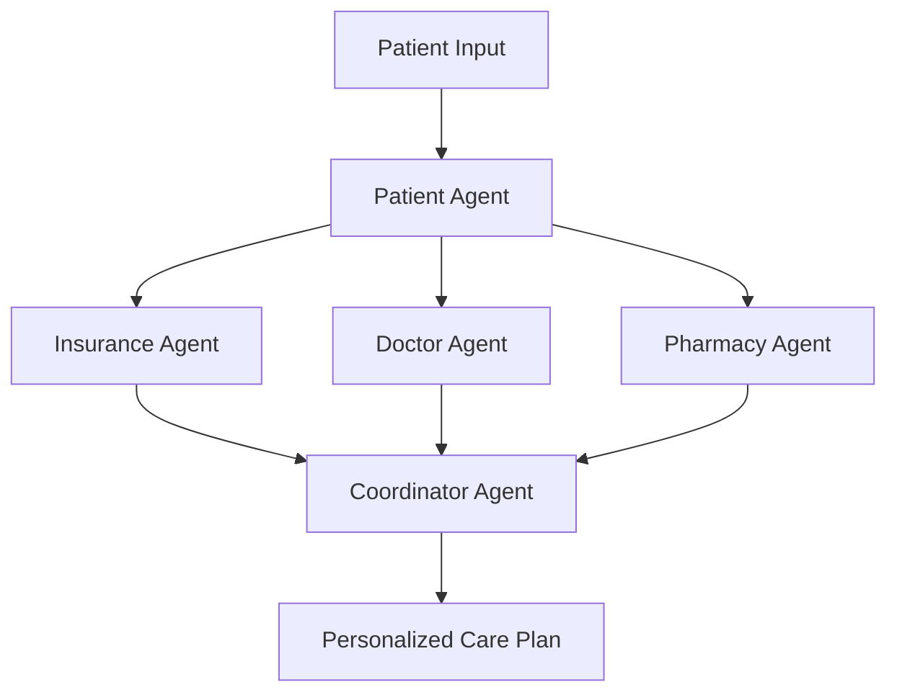

# NaviCare - AI-Powered Healthcare Navigation System


> **Simplifying healthcare navigation through intelligent AI agents**

NaviCare is a comprehensive healthcare navigation platform that streamlines the patient journey from symptom assessment to care coordination. Our multi-agent AI system provides personalized recommendations for insurance coverage, doctor selection, pharmacy options, and appointment scheduling.

## ✨ Features

🏥 **Multi-Agent AI System** - Coordinated specialists working together  
🛡️ **Insurance Verification** - Real-time coverage validation and cost estimation  
👨‍⚕️ **Doctor Matching** - Find qualified specialists based on symptoms and preferences  
💊 **Pharmacy Comparison** - Best prices and locations for medications  
📅 **Smart Coordination** - Unified care plan with optimized recommendations  
📱 **Responsive Design** - Works seamlessly across all devices  

## 🚀 Quick Start

### Prerequisites
- Modern web browser (Chrome 88+, Firefox 85+, Safari 14+)
- Local web server (optional but recommended)

### Installation

1. **Clone the repository**
   ```bash
   git clone https://github.com/your-username/navicare.git
   cd navicare
   ```

2. **Start a local server**
   ```bash
   # Using Python
   python -m http.server 8000
   
   # Using Node.js
   npx serve .
   ```

3. **Open in browser**
   ```
   http://localhost:8000
   ```

### Demo Access
Use these credentials to explore the platform:
- **Username:** `test_user`
- **Password:** `test`

## 🏗️ Architecture

NaviCare employs a sophisticated multi-agent architecture where specialized AI agents collaborate to provide optimal healthcare recommendations:



### Agent Responsibilities

| Agent | Purpose | Key Features |
|-------|---------|--------------|
| 🏥 **Patient Agent** | Analyzes symptoms and coordinates workflow | Symptom assessment, task distribution |
| 🛡️ **Insurance Agent** | Validates coverage and calculates costs | Network verification, copay calculation |
| 👨‍⚕️ **Doctor Agent** | Matches patients with qualified specialists | Availability checking, rating analysis |
| 💊 **Pharmacy Agent** | Finds optimal medication sources | Price comparison, location mapping |
| 📋 **Coordinator Agent** | Compiles comprehensive care plans | Conflict resolution, plan optimization |

## �️ Tech Stack

- **Frontend:** HTML5, CSS3, JavaScript (ES6+)
- **Styling:** Custom CSS with CSS Grid and Flexbox
- **Icons:** Font Awesome 6.4.0
- **Fonts:** Inter (Google Fonts)
- **Architecture:** Multi-agent system design

## 🎨 Design System

### Color Palette
Our healthcare-focused design uses a professional medical color scheme:

| Color | Hex Code | Usage |
|-------|----------|-------|
| Medical Blue | `#0077be` | Primary brand color, trust and professionalism |
| Healthcare Teal | `#00a693` | Secondary color, calming and reliable |
| Light Blue | `#4fc3f7` | Accent color, modern and approachable |
| Success Green | `#22c55e` | Positive outcomes and confirmations |
| Warning Orange | `#f59e0b` | Alerts and important notices |
| Error Red | `#ef4444` | Errors and critical warnings |

### Typography
- **Font Family:** Inter (Google Fonts)
- **Weights:** 300, 400, 500, 600, 700, 800
- **Responsive scaling:** Fluid typography with CSS custom properties

## 📱 Responsive Design

NaviCare adapts seamlessly to all device sizes:

- **📱 Mobile:** < 768px - Optimized for touch interactions
- **📊 Tablet:** 768px - 1024px - Balanced layout with touch support  
- **🖥️ Desktop:** > 1024px - Full-featured experience with animations

## 🔧 Development

### File Structure
```
NaviCare/
├── index.html              # Login page
├── dashboard.html          # Main application interface
├── dashboard.js           # Multi-agent workflow logic
├── dashboard.css          # Dashboard styling
├── styles.css             # Login page styles  
├── script.js              # Login functionality
└── README.md
```

### Code Style
- Use semantic HTML5 elements
- Follow BEM CSS methodology
- Write clean, documented JavaScript
- Ensure mobile-first responsive design
- Test across multiple browsers

## 🔒 Security & Privacy

- **🛡️ Input Validation:** Comprehensive form validation
- **🔐 XSS Prevention:** Input sanitization and secure coding practices
- **🏥 HIPAA Considerations:** Built with healthcare privacy in mind
- **🔒 Secure Transmission:** HTTPS-ready for production deployment

## 🌟 Upcoming Features

- [ ] **Real Insurance API Integration**
- [ ] **Live Doctor Availability**
- [ ] **Prescription Management**
- [ ] **Appointment Scheduling**
- [ ] **Patient History Tracking**
- [ ] **Telehealth Integration**
- [ ] **Mobile App Development**

## � License

This project is licensed under the MIT License - see the [LICENSE](LICENSE) file for details.

## 🙏 Acknowledgments

- **Healthcare Professionals** for domain expertise guidance
- **Open Source Community** for tools and inspiration
- **Accessibility Standards** for inclusive design principles

---

<div align="center">

**Made with ❤️ for better healthcare navigation**

[](LICENSE)
[](CONTRIBUTING.md)
[](CODE_OF_CONDUCT.md)

[⭐ Star this repo](../../stargazers) • [🍴 Fork it](../../fork) • [📬 Report issues](../../issues)

</div>